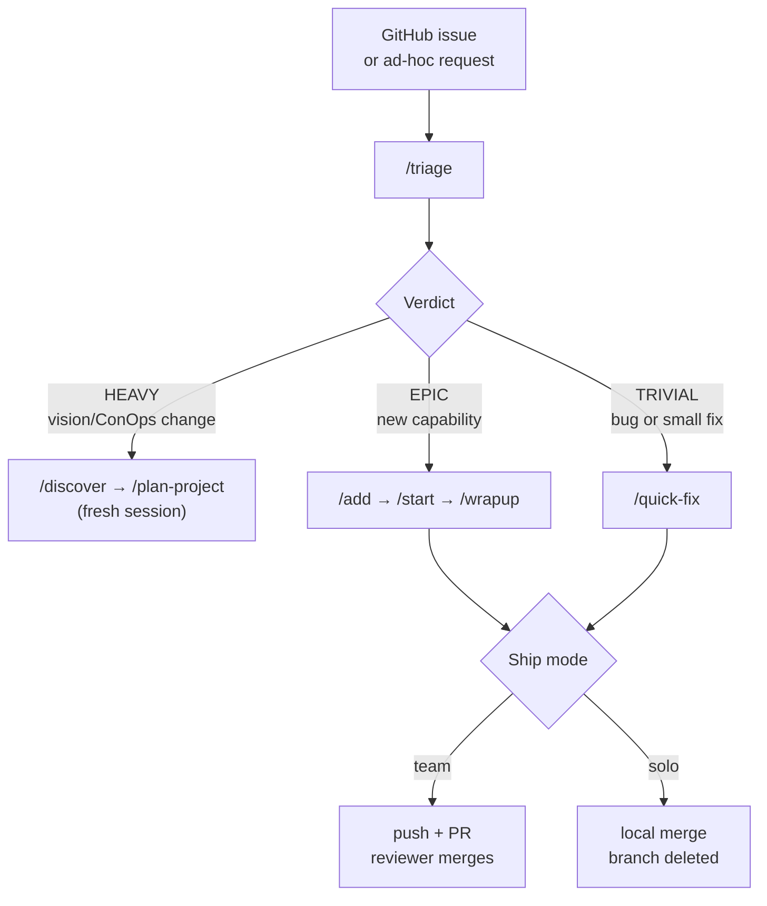
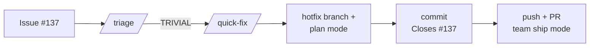

# Epic Workflow

> All slash commands below belong to the `epic-workflow` plugin. This README uses the short form (`/triage`, `/start`, etc.) for readability; invoke them at the prompt with the full form (`/epic-workflow:triage`, `/epic-workflow:start`, etc.) or use the short form if no other plugin uses the same skill name.

## Skills

| Command | Purpose | Status Transition |
|---|---|---|
| `/discover` | Adaptive interview that produces product-vision.md + concept-of-operations.md | — (writes planning docs) |
| `/plan-project` | Derive implementation plan (phases, epics, specs) from vision + ConOps docs | Creates all epics as "Not Started" |
| `/setup` | Audit `CLAUDE.md` for required sections, stub `architecture.md` and `design-notes.md` | — |
| `/add <description>` | Add new epic(s) from natural language — writes spec(s), updates index | Creates as "Not Started" |
| `/triage <issue\|description>` | Advisory routing — sizes requests against vision/ConOps and recommends HEAVY / EPIC / TRIVIAL; can dispatch `/add` or `/quick-fix` in-session on user confirm | — (writes no files) |
| `/quick-fix <issue\|description>` | Lightweight path for trivial fixes — creates `hotfix/` branch, implements, ships (solo or team PR) | — (not tracked in index) |
| `/start <id>` | Implement the epic — loads spec, plans, implements, verifies | Not Started → In Progress → **Implemented** (sets date) |
| `/wrapup <id>` | Independent review — verifies implementation, closes out, orients to next, and ships (solo merge or team PR) | Implemented → **Complete** (sets date) |
| `/pause` | Stop mid-epic, save progress | In Progress → **Paused** |
| `/status` | Read-only project dashboard — progress, active work, stale epics, next actions | — (read-only) |
| `/refresh-docs` | Refresh architecture and design docs to match the as-built codebase | — (updates docs, not epic status) |

## Choosing a Path

Not sure which skill to run? Start with `/triage` — it sizes the request against the project's vision and routes you to the right path:



**When in doubt, lean toward EPIC.** The rubric's cross-layer override catches changes that look trivial in the issue body but actually cascade through multiple layers (UI + domain + integration + tests). A too-small spec is cheap; a missing spec is not.

## Epic Lifecycle

```
[Idea] → [Vision & ConOps] → [Implementation Plan] → Not Started → In Progress → Implemented → Complete
            ^                      ^                        ^              ^             ^
  /discover  /plan-project  /start  /start  /wrapup
       (interviews)          (derives epics)              (begins)            (finishes)       (independent review)

                              /status — read-only dashboard at any point
```

Each epic's status sidecar (`docs/implementation-plan/status/epic-<id>.md`) has two date fields:
- **Implemented** — set by `/start` when implementation + self-verification is done
- **Completed** — set by `/wrapup` when independent review passes

An epic with an `implemented:` date but no `completed:` date is waiting for independent review.

## Starting a Brand New Project (Greenfield)

Use this path when there is no existing product vision, no implementation plan, and no code yet. The goal is to go from an idea to a fully planned set of epics.

```
/discover → /plan-project → /setup → /start <id>
```

### Step 1: Discovery — `/discover`

Run `/discover` with a description of what you want to build. Claude conducts an adaptive interview in 4 phases:

1. **Identity & Problem** — product name, problem statement, target users, vision statement
2. **Goals, Scope & Boundaries** — MVP goals, feature scope, out-of-scope items
3. **Scenarios** — detailed operational scenarios with step-by-step user interactions (this is the heart)
4. **Constraints, Data & Future** — design direction, data strategy, backlog, glossary

Claude drafts content for you to react to (confirm, refine, reject) — not open-ended questions. Each phase is gated by your approval before moving on.

**Output:**
- `docs/product-vision-planning/product-vision.md` (11 sections)
- `docs/product-vision-planning/concept-of-operations.md` (9 sections with detailed scenarios)

### Step 2: Planning — `/plan-project`

Run `/plan-project`. Claude reads the vision and ConOps documents and derives the implementation plan:

1. **Scenario decomposition** — extracts capabilities from every ConOps scenario step
2. **Capability grouping** — deduplicates and groups by implementation layer
3. **Epic formation** — clusters capabilities into session-sized epics (5-15 acceptance criteria each)
4. **Negotiation** — presents the full plan (phases, epics, dependency graph) for your approval before writing any files

**Output:**
- `docs/implementation-plan/phase-N-*/index.md` (one per phase — epic ID, name, dependencies)
- `docs/implementation-plan/status/epic-<id>.md` (one per epic — status sidecar)
- `docs/implementation-plan/README.md` (lifecycle prose and Quick Start)
- `docs/implementation-plan/index.md` (thin stub — human-readable pointer)
- Epic spec files in `docs/implementation-plan/phase-N-*/`

### Step 3: Setup — `/setup`

Run `/setup` to audit `CLAUDE.md` for required sections (tech stack, quality gates, reminders, etc.) and stub `architecture.md` + `design-notes.md`.

### Step 4: Build — `/start <id>`

Begin implementing. One epic per session, following the epic lifecycle described below.

## Evolving an Existing Project (Brownfield)

Use this path when the project already has a product vision, implementation plan, and completed epics. The goal is to add new features or shift direction without starting from scratch.

```
/discover → /plan-project → /start <id>
```

### Step 1: Discovery — `/discover`

Run `/discover` with a description of what's changing. Claude detects brownfield mode automatically (it checks for an existing `product-vision.md` with substantive content and completed epics).

In brownfield mode, Claude:
- Reads the existing vision and ConOps documents as the starting point
- Only interviews you about what's new or changed — skips sections that don't need updates
- Shows current content alongside proposed changes so you can see exactly what's different
- Updates the documents in place (increments version, updates date)

**Output:**
- Updated `docs/product-vision-planning/product-vision.md`
- Updated `docs/product-vision-planning/concept-of-operations.md`
- `.discovery-changelog.md` at the repo root (the handoff to planning)

### Step 2: Planning — `/plan-project`

Run `/plan-project`. Claude detects brownfield mode and reads the discovery changelog as its primary input.

In brownfield mode, Claude:
- Maps new capabilities against existing epics to avoid duplication
- Flags cases where a new capability extends a completed epic's scope (risky — discussed with you)
- Forms new epics and adds them to the existing plan using 7-character random alphanumeric IDs (e.g., `a3f2K7p`); existing integer-IDed epics keep their IDs unchanged
- Preserves all existing epic rows and statuses in the index
- Archives the changelog to `.discovery-changelog-{date}.md` to prevent re-processing

**Output:**
- New rows appended to existing `docs/implementation-plan/phase-N-*/index.md` files
- New `docs/implementation-plan/status/epic-<id>.md` sidecars for each new epic
- New epic spec files in existing or new phase directories

### Step 3: Build — `/start <id>`

Begin implementing the first new epic. `/setup` is typically not needed again since it was already run during the initial project setup.

### Discovery Changelog Handoff

The `.discovery-changelog.md` file is the explicit handoff between discover and plan-project in brownfield mode. It captures:
- What changed in the vision/ConOps documents
- New capabilities identified
- Priority signals from the user (what's most important, what's deferred)

After `/plan-project` processes the changelog, it archives the file to `.discovery-changelog-{date}.md`. If no changelog exists (e.g., you edited the vision docs manually instead of running `/discover`), `/plan-project` falls back to full-document delta analysis using git history.

### When to Use Each Approach

| Situation | Command |
|-----------|---------|
| Adding a single well-defined epic | `/add` — fastest path, no discovery needed |
| Adding several related features within the existing vision | `/plan-project` — reads existing docs, derives new epics |
| Shifting product direction, adding new user groups, or rethinking scope | `/discover` first, then `/plan-project` |

## Documentation Currency Loop

The epic workflow maintains architecture and design documentation through a closed loop:

```
/setup
    → stubs docs/architecture.md + docs/design-notes.md from CLAUDE.md

/start <id>
    → reads architecture.md + design-notes.md as context
    → writes session-handoffs/epic-<id>-implemented.md (Key Files, Key Decisions)

/wrapup <id>
    → reads architecture.md to verify consistency
    → writes session-handoffs/epic-<id>-complete.md
    → Phase 3 (Orient) checks whether docs need a refresh

/refresh-docs
    → reads all complete handoffs (Key Files + Key Decisions)
    → reads actual source files to verify doc claims
    → shows gap analysis, rewrites docs to as-built state
```

**Handoffs are the staging buffer for documentation.** Design decisions accumulate in handoff files as epics complete. `/refresh-docs` drains that buffer into the permanent docs on demand — after a phase, before a release, or whenever the drift becomes meaningful.

## Workflow

```
0. Bootstrap the project (once, before any epics exist):
   /discover
   → Adaptive interview produces product-vision.md and concept-of-operations.md
   /plan-project
   → Derives implementation plan with phases, epics, and specs from the vision + ConOps

1. First-time setup (once per project):
   /setup
   → Audits CLAUDE.md for required sections, fixes gaps interactively
   → Creates docs/architecture.md and docs/design-notes.md as planning stubs

2. Open a new Claude Code session in the repo root:
   /start <id>
   → Claude reads the epic spec, architecture docs, and any prior handoffs
   → Claude enters plan mode and proposes an implementation plan
   → You approve (or adjust) the plan
   → Claude creates tasks and begins working
   → After implementation, Claude satisfies the Verification section as additional work
   → Claude runs CLAUDE.md quality gates and reports results
   → Status moves to "Implemented" with today's date

3. When implementation is done, open a NEW session:
   /wrapup <id>
   → Phase 1 (Verify): Acts as independent reviewer, re-reads spec, verifies all criteria, produces report
   → Phase 2 (Complete): If PASS — writes handoff file, marks epic "Complete" with today's date
   → Phase 3 (Orient): Reads dependency graph, presents unblocked epics and recommended next action
   → Phase 3 also checks if architecture/design docs need a refresh
   → If FAIL: lists gaps for the implementer to fix (does not proceed to Phase 2 or 3)

4. If stopping early:
   /pause

5. Check project status at any time:
   /status
   → Read-only dashboard: progress, active work, stale paused epics, next actions

6. After completing a phase or before a release:
   /refresh-docs
   → Reads all handoffs, reads source files, shows gap analysis
   → Rewrites architecture.md and design-notes.md to as-built state
```

## What Happens Automatically

- **`/setup`** reads `CLAUDE.md`, checks for required sections (Tech Stack, Epic Workflow, Quality Gates, Reminders, References), interactively fills any gaps, and creates documentation stubs if they don't exist
- **`/start`** checks dependencies are met (prerequisite epics must be "Implemented" or "Complete"), reads prior session handoffs, sets status to "In Progress", implements all acceptance criteria, satisfies the Verification section, runs CLAUDE.md quality gates, then sets status to "Implemented" with today's date
- **`/wrapup`** verifies the epic is in "Implemented" status, then runs three phases: (1) **Verify** — independently inspects code, runs checks, produces a structured verification report; (2) **Complete** — if the verdict passes, writes the handoff file and marks the epic "Complete" with today's date; (3) **Orient** — reads the dependency graph and presents which epics are now unblocked, parallelization opportunities, recommended next action, and whether the documentation needs a refresh
- **`/pause`** snapshots progress, writes resume instructions to `session-handoffs/`, updates `index.md` to "Paused"
- **`/status`** reads the implementation plan index, computes progress statistics, flags stale paused epics (>7 days), identifies unblocked ready-to-start epics from the dependency graph, and suggests the next action — strictly read-only, modifies no files
- **`/refresh-docs`** aggregates Key Files and Key Decisions from all complete handoffs, reads the actual source files, produces a gap analysis table comparing doc claims against reality, and rewrites both documents after user confirmation

## Key Files

| File | Purpose |
|---|---|
| `CLAUDE.md` | Auto-loaded every session — project context, tech stack, reminders |
| `docs/product-vision-planning/product-vision.md` | Product vision & brief — written by `/discover` |
| `docs/product-vision-planning/concept-of-operations.md` | Concept of operations — written by `/discover` |
| `docs/implementation-plan/README.md` | Human prose — lifecycle diagram, Quick Start. Skills never write to it. |
| `docs/implementation-plan/index.md` | Thin stub pointing at phase indexes + sidecars. Skills do not read/write it. |
| `docs/implementation-plan/phase-N-*/index.md` | Per-phase epic registry — epic ID, name, dependencies. Append-only; written by `/add` and `/plan-project`. |
| `docs/implementation-plan/status/epic-<id>.md` | Per-epic status sidecar — `status`, `implemented`, `completed`, `handoff`. Each branch owns only its own sidecar. |
| `docs/implementation-plan/phase-N-*/epic-<id>-*.md` | Epic specs (acceptance criteria + verification). `<id>` is a 7-char alphanumeric for new epics, or a legacy integer for pre-v2.0.0 epics. |
| `docs/implementation-plan/session-handoffs/` | Handoff files written by `/start`, `/wrapup`, and `/pause` |
| `docs/architecture.md` | System architecture — stubbed by `/setup`, refreshed by `/refresh-docs` |
| `docs/design-notes.md` | Design decisions — stubbed by `/setup`, refreshed by `/refresh-docs` |

> **Migrating from v2.4.0?** Run `/epic-workflow:migrate-2.5` once per project. It converts the legacy `index.md` status table into per-phase indexes + status sidecars in a single atomic commit.

## Triage & Collaboration Modes

- **Start with triage for GitHub issues.** `/triage <issue-number>` fetches
  the issue via `gh issue view`, compares scope against vision/ConOps, and routes:
  - **HEAVY** — vision/ConOps impact → prints `/discover` + `/plan-project` commands
    (run in a fresh session)
  - **EPIC** — new capability worth a spec → offers to run `/add` now
  - **TRIVIAL** — bug fix / small enhancement → offers to run `/quick-fix` now

- **Ship modes** are prompted in `/wrapup` and `/quick-fix` — presented neutrally, no
  default, no recommendation. There is no reliable way to auto-determine the right mode
  (repo permissions, team conventions, project phase, and personal preference all vary),
  so the user picks every time:
  - **Solo** — local `git merge --no-ff`, feature branch deleted, not pushed.
  - **Team** — push branch + `gh pr create`, reviewer merges in GitHub. Does not run
    `gh pr merge`; does not delete the branch.

- **Branch prefixes:** `feature/epic-<id>-<short-name>` for epic work; `hotfix/issue-<N>-<slug>`
  (or `hotfix/<slug>`) for quick-fixes.

- **Issue numbers flow end-to-end.** Issue numbers captured by `/triage` from `gh issue view`
  flow through to the epic spec's `Source:` header, all epic-chain commit trailers
  (`Closes #<N>` on `/start` and `/wrapup`; `Refs #<N>` on `/pause`), and the wrapup
  team-mode PR body's `Closes #<N>` line.

## Epic IDs

From v2.0.0 onward, new epics are identified by a **7-character random alphanumeric ID**
(e.g. `a3f2K7p`) instead of an incrementing integer. This prevents ID collisions when
team members run `/add` concurrently on different branches. Existing integer-IDed epics
(`Epic 7`, `Epic 6.5`) keep their IDs unchanged; all skills parse both formats.

You pass the ID verbatim to any skill that takes an epic argument:

```
/start a3f2K7p
/pause
/wrapup a3f2K7p
```

## Scenarios

Two short worked examples showing how the skills fit together.

### Scenario A — Bug fix via `/quick-fix`

**Issue #137:** "Signup form — width is wrong on `/signup` and validation doesn't fire on submit"

```
/triage 137
  → Verdict: TRIVIAL (two bugs on an existing page, well under 2 hours)
  → Dispatches: /quick-fix 137

/quick-fix 137
  → Creates branch: hotfix/issue-137-<slug> (from develop)
  → Asks ship mode → you pick "team"
  → Plan mode: read files → implement → run quality gates
                → ask about manual verification → commit → push + PR
  → Commit: fix: signup form width cap and submit validation
             (trailer: Closes #137)
  → PR body: Verification Highlights + Conclusion + Manual-verification disclosure
```



### Scenario B — Deceptively-trivial enum change via `/triage` → EPIC

**Issue #201:** "Add 'High' value to Part Complexity dropdown"

The issue body mentions that changing this enum cascades to the editor dropdown, list filter chips, detail-page badge, dashboard chart, backend tolerance recomputation, third-party QA integration, test fixtures, and docs. Looks small; isn't.

```
/triage 201
  → Cross-layer override fires (UI + domain + integration + tests)
  → Verdict: EPIC (not TRIVIAL, despite the "just another enum value" framing)
  → Dispatches: /add "[issue #201] <canonical-description>"

/add
  → Writes epic spec with **Source:** Issue #201 in the header
  → Acceptance criteria cover every affected layer

(fresh session) /start <epic-id>
  → Implements across all layers
  → Final commit: feat(epic-<id>): ... (trailer: Closes #201)

(fresh session) /wrapup <epic-id>
  → Independent verification (counts + highlights + conclusion)
  → Asks about manual verification
  → Opens team PR; body has "Closes #201" directly under Summary
```

```mermaid
flowchart LR
    A[Issue #201] --> B[/triage/]
    B -->|EPIC| C[/add/]
    C --> D[spec with<br/>Source: Issue #201]
    D --> E[/start/<br/>Closes #201 trailer]
    E --> F[/wrapup/<br/>team PR, Closes #201]
```

**How the issue number survives the chain:** `/triage` injects `[issue #N]` into the `/add` args → `/add` writes `**Source:** Issue #N` in the spec header → `/start` reads the header and appends `Closes #N` to the final commit → `/pause` (if used mid-epic) appends non-closing `Refs #N` instead → `/wrapup` reads the header and places `Closes #N` under the PR Summary. Legacy epics without a `Source:` line skip the trailer/line gracefully.

## Rules of Thumb

- **One epic per session.** Start fresh for each epic so Claude has clean context.
- **Always `/pause` before closing** if the epic isn't done. Don't just close the terminal — the handoff file is what preserves your progress.
- **Check `index.md`** if you're unsure what's next. The dependency graph shows what's unblocked.
- **UI epics** will trigger the brand guidelines skill for brand compliance if one is configured in the project.
- **Don't skip epics** unless the dependency graph allows it. Parallel-safe epics are visible in the graph.
- **Run `/refresh-docs` before a release.** Architecture and design docs should reflect the as-built system at each release boundary, not the original plan.
- **Record decisions in handoffs, not in the docs directly.** Let `/refresh-docs` consolidate them — this prevents partial updates and keeps the docs internally consistent.
- **Re-run `/discover` when the product direction changes.** If you're adding features within the existing vision, use `/add` directly. If the product scope or user base is shifting, re-run `/discover` in brownfield mode first — it will capture the delta and hand it off to `/plan-project`.
- **Re-run `/plan-project` when you need multiple new epics from a vision change.** For a single new epic, `/add` is faster. For a batch of related epics that need dependency analysis and phase placement, `/plan-project` is the right tool.
- **Every `/wrapup` and `/quick-fix` asks whether you performed any manual verification.** Answer honestly — a plain `No` is perfectly fine; the disclosure is the point, not the ceremony.

