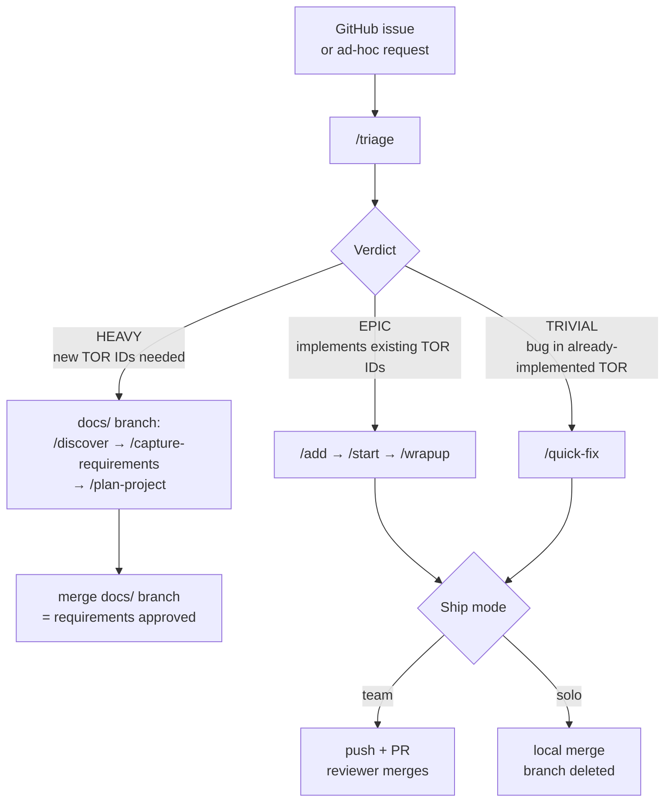

# Peak Workflow

> All slash commands belong to the `peak-workflow` plugin. This README uses the short form (`/discover`, `/start`, etc.) for readability; invoke them with the full form (`/peak-workflow:discover`, `/peak-workflow:start`, etc.) or use the short form if no other plugin uses the same skill name.

## Philosophy

Peak Workflow is a requirements-driven development lifecycle in the spirit of DO-330 TQL-5. The core principle: **requirements are the ground truth**. Tests are derived from requirements — not from implementation. You cannot verify "a bad implementation is correctly bad" when the verification baseline is independent of the code.

The formal requirements baseline lives in Gherkin-style `.feature.md` files with TOR requirement IDs (`TOR-NN-XXXXXXX`). Each TOR ID is:
- The **acceptance criterion** for an epic (an epic's spec lists the TOR IDs it implements)
- The **verification procedure** for wrapup (the Given/When/Then defines exactly what a passing test must demonstrate)
- An **immutable foreign key** once merged to develop (referenced by epic specs, tests, and handoffs)

## Skills

| Command | Purpose | Branch / Status |
|---|---|---|
| `/setup` | Audits `CLAUDE.md`, stubs `architecture.md`, `design-notes.md`, and `docs/requirements/README.md` — **run once per project, before `/discover`** | — |
| `/discover` | Adaptive interview that produces `product-vision.md` + `concept-of-operations.md` | Creates `docs/{task-short-name}` branch |
| `/capture-requirements` | Derives TOR requirements (`.feature.md` files + `.feature.tracing.json` sidecars) from vision + ConOps | Continues on `docs/` branch |
| `/plan-project` | Derives implementation plan (phases, epics, Requirements Anchors specs) from TOR requirements | Continues on `docs/` branch |
| `/add <description>` | Adds new epic(s) referencing existing TOR IDs | — (writes planning docs) |
| `/triage <issue\|description>` | Advisory routing — HEAVY (needs new TOR IDs) / EPIC (implements existing TOR IDs) / TRIVIAL (bug in already-implemented TOR) | — (writes no files) |
| `/quick-fix <issue\|description>` | Lightweight path for trivial bugs in already-implemented TORs — creates `hotfix/` branch, implements, ships | Not tracked in implementation plan |
| `/start <id>` | Implement the epic — loads TOR Given/When/Then, creates user-story tasks, implements, verifies | Not Started → In Progress → **Implemented** |
| `/wrapup <id>` | Independent review — verifies each TOR's Given/When/Then is satisfied, closes out, ships | Implemented → **Complete** |
| `/pause` | Stop mid-epic, save progress | In Progress → **Paused** |
| `/status` | Read-only dashboard — epic progress, Requirements Coverage, active work, next actions | — (read-only) |
| `/refresh-docs` | Refresh `architecture.md` + `design-notes.md` to match as-built codebase | — (docs only, not requirements) |
| `/migrate-2.5` | One-shot migration from legacy `index.md` layout to per-phase indexes + status sidecars | — (migration only) |

## Branch Families

| Branch | Pattern | Scope |
|---|---|---|
| Planning | `docs/{task-short-name}` | discover → capture-requirements → plan-project → add (cohesive; merge = approval) |
| Implementation | `feature/epic-<id>-<short-name>` | start → wrapup |
| Quick fix | `hotfix/<slug>` or `hotfix/issue-<N>-<slug>` | quick-fix |

**Develop-branch invariant:** anything on `develop` is approved. The merge event (solo merge or team PR) is the approval signature.

## Choosing a Path



## Artifact Hierarchy

```
docs/product-vision-planning/
  product-vision.md           ← product intent (written by /discover)
  concept-of-operations.md    ← user scenarios (written by /discover)
  changelogs/                 ← brownfield discovery changelogs

docs/requirements/
  NN-{name}.feature.md        ← TOR requirements (written by /capture-requirements)
  NN-{name}.feature.tracing.json  ← TOR → vision/ConOps linkage (written by Haiku sub-agent)
  README.md                   ← conventions (written by /setup)

docs/implementation-plan/
  phase-N-*/index.md          ← epic registry per phase (epic ID, name, dependencies)
  phase-N-*/epic-<id>-*.md    ← epic specs with Requirements Anchors tables
  status/epic-<id>.md         ← status sidecar (status, implemented, completed, requirements:)
  session-handoffs/           ← implemented and complete handoff files
  README.md                   ← lifecycle prose (never written by skills after creation)

docs/architecture.md          ← system architecture (stubbed by /setup, refreshed by /refresh-docs)
docs/design-notes.md          ← design decisions (same)
```

## TOR Requirement IDs

Format: `TOR-{NN}-{XXXXXXX}`

| Part | Meaning |
|---|---|
| `TOR` | Tool/Product Requirements prefix |
| `{NN}` | Feature file number, 2-digit zero-padded (e.g., `01`). **Stable once assigned.** |
| `{XXXXXXX}` | 7-character random alphanumeric (parallel-safe, collision-resistant) |

Example: `TOR-01-Afs657G` lives in `docs/requirements/01-cli.feature.md`.

TOR IDs are **immutable once merged to develop.** They are foreign keys — epic specs, tests, and handoffs all reference them by ID. If a requirement changes substantively, it goes through `/peak-workflow:capture-requirements` (brownfield mode) on a `docs/` branch as a change-control event.

## Epic Spec Structure

Epic specs no longer contain prose Acceptance Criteria or Verification sections. Instead:

```markdown
# Epic a3f2K7p: CLI Version and Help Flags

**Phase:** 1 — Foundation
**Status:** Not Started
**Dependencies:** —

---

## Description

Implements the `-v` / `--version` and `--help` command-line flags. Users need to confirm
tool installation and access usage documentation from the command line.

## Requirements Anchors

> The TOR requirement IDs listed below are the acceptance criteria and verification baseline
> for this epic. Each ID maps to a Gherkin scenario in the referenced feature file.
> `/peak-workflow:start` reads each TOR's Given/When/Then to drive implementation and tests.
> `/peak-workflow:wrapup` independently verifies each TOR's Given/When/Then is satisfied.

| TOR ID | Feature File | Scenario Title |
|--------|--------------|----------------|
| TOR-01-Afs657G | `docs/requirements/01-cli.feature.md` | The tool shall report its part number and version to standard output |
| TOR-01-Bcd2345 | `docs/requirements/01-cli.feature.md` | The tool shall display usage help when invoked with --help |

## Key Components

- `src/cli.py` — add version and help flag handlers
- `tests/test_cli.py` — TOR-based tests
```

## Status Sidecar Format

```
status: Not Started
implemented: —
completed: —
handoff: —
requirements: TOR-01-Afs657G, TOR-01-Bcd2345
```

The `requirements:` field is how `/peak-workflow:status` computes the Requirements Coverage dashboard.

## Greenfield Project — Quick Start

```
/peak-workflow:setup             → audit CLAUDE.md, stub architecture.md + design-notes.md (run once, before /discover)
/peak-workflow:discover          → creates docs/ branch, produces vision + ConOps
/peak-workflow:capture-requirements  → derives TOR requirements on same docs/ branch
/peak-workflow:plan-project      → derives epics from TOR IDs on same docs/ branch
[merge docs/ branch]             → requirements and plan baseline approved
/peak-workflow:start <id>        → implement first epic (tasks = user stories per TOR ID)
/peak-workflow:wrapup <id>       → independent TOR verification, ship
```

> **Why run setup first?** `/discover` reads `CLAUDE.md` for project context, and `start` /
> `wrapup` depend on the Verification & Quality Gates section that `setup` populates. Running
> discover without setup means quality gates aren't in place until after the planning session —
> and on a small project, that gap can go unnoticed until the first wrapup fails.
>
> **On ceremony overhead:** The discover → requirements → planning sequence amortizes as the
> project grows — every new request routes through `/triage`, which tells you whether it needs
> new TOR IDs (HEAVY), implements existing ones (EPIC), or is a trivial bug (TRIVIAL). For a
> one-off script, `epic-workflow` may be a better fit.

## Brownfield / Evolution Path

```
/peak-workflow:discover          → brownfield mode: creates docs/ branch, updates vision + ConOps
/peak-workflow:capture-requirements  → brownfield mode: appends new TOR IDs, archives changelog
/peak-workflow:plan-project      → brownfield: new epics for unplanned TOR IDs
[merge docs/ branch]             → delta requirements and new epics approved
/peak-workflow:start <id>        → implement new epics
```

## Requirements & Verification

The key distinction between peak-workflow and a typical Agile workflow:

| | Typical | Peak Workflow |
|---|---|---|
| Acceptance criteria | Prose checkboxes in the spec | TOR IDs referencing Gherkin scenarios |
| Test derivation | Implementer decides what to test | Given/When/Then dictates what the test must verify |
| Wrapup baseline | Did the implementation match the spec? | Does the implementation satisfy the TOR Given/When/Then? |
| Requirements source | Implicitly distributed across docs | Formally captured in `docs/requirements/*.feature.md` |
| Requirements approval | N/A | Merge of `docs/` branch (solo or team PR) |

**Quick-fixes never change requirements.** If a fix requires modifying a TOR's Given/When/Then, re-triage as HEAVY. If a quick-fix lands and later someone thinks the requirement itself was wrong, that's a new HEAVY event — not a retroactive quick-fix.

## Key Files

| File | Purpose |
|---|---|
| `CLAUDE.md` | Auto-loaded every session — project context, tech stack, quality gates |
| `docs/product-vision-planning/product-vision.md` | Product vision (written by `/discover`) |
| `docs/product-vision-planning/concept-of-operations.md` | Operational scenarios (written by `/discover`) |
| `docs/requirements/*.feature.md` | TOR requirements — Gherkin feature files (written by `/capture-requirements`) |
| `docs/requirements/*.feature.tracing.json` | TOR → vision/ConOps linkage (written by Haiku sub-agent) |
| `docs/implementation-plan/phase-N-*/index.md` | Per-phase epic registry — append-only |
| `docs/implementation-plan/status/epic-<id>.md` | Per-epic sidecar — status + requirements: field |
| `docs/implementation-plan/phase-N-*/epic-<id>-*.md` | Epic specs (Requirements Anchors format) |
| `docs/implementation-plan/session-handoffs/` | Implemented and complete handoff files |
| `docs/architecture.md` | System architecture (stubbed by `/setup`, refreshed by `/refresh-docs`) |
| `docs/design-notes.md` | Design decisions (same as above) |

## Migration from epic-workflow

There is no automated migration. Peak-workflow and epic-workflow are sibling plugins with fundamentally different artifact sets (epic-workflow epic specs have prose Acceptance Criteria; peak-workflow specs have Requirements Anchors with TOR IDs). Recommended approach:

1. Keep in-flight epic-workflow epics on epic-workflow until complete.
2. Install peak-workflow alongside.
3. Run `/peak-workflow:discover` (brownfield) to refresh vision/ConOps.
4. Run `/peak-workflow:capture-requirements` to establish the TOR baseline.
5. New work uses `/peak-workflow:plan-project`, `/peak-workflow:add`, `/peak-workflow:start`.
6. Old epic-workflow specs and handoffs remain as historical record.
