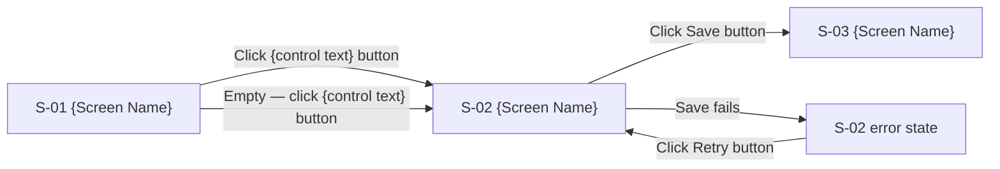
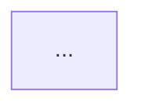

# Screen Inventory Template — `/peak-workflow:mockup`

Used by `mockup` Step 4.2 (greenfield create, brownfield append). Write the populated template
to `docs/product-vision-planning/ux/screens.md`. There is exactly one inventory per project —
`S-NN` IDs are referenced by the ConOps (`/peak-workflow:mockup` Step 7), by TOR Given/When/Then
clauses (`/peak-workflow:capture-requirements`), and later by epic specs, so they behave like
feature numbers: **stable and append-only**.

---

## Placeholder Reference

| Placeholder | Meaning |
|---|---|
| `{Product Name}` | From Product Vision Section 1 |
| `{N.N}` | Document version — `1.0` on create; minor bump on every brownfield append |
| `{S-NN}` | Screen ID, 2-digit zero-padded, sequential (`S-01`, `S-02`, …) |
| `{Screen Name}` | Title-case noun phrase the user would say ("Orders List", "Sign In") |
| `{kebab-name}` | `{Screen Name}` in kebab case — the wireframe filename stem |
| `{wireframe}` | `wireframes/{S-NN}-{kebab-name}.html`, relative to `ux/`; `—` for the Application menu and Window rows |
| `{purpose}` | One sentence: what the actor accomplishes on this screen |
| `{entry points}` | Nav item, `{S-NN} "{control text}"` on another screen, deep link, or app launch |
| `{control text}` | The exact visible text of a control, followed by its kind: `"Save" button` |
| `{data shown}` | Fields, lists, counts the screen renders |
| `{states}` | `loading / empty / error / populated`, or `n/a — not data-bearing` |
| `{S3.4}` | ConOps Section 5 reference — Scenario 3, step 4 |
| `{Scenario N: Title}` | The ConOps scenario heading, verbatim |

---

## File Format

```markdown
# {Product Name} — Screen Inventory

**Document Version:** {N.N}
**Date:** {today's date}
**Status:** Draft
**Companion:** `concept-of-operations.md` v{N.N} (Section 5 steps cite these IDs)
**Wireframes:** `wireframes/{S-NN}-{kebab-name}.html` — open in a browser; grayscale on purpose

---

## App Shell

{Which of the three shells in `WIREFRAME_TEMPLATE.md` App Shell Conventions applies — site header,
sidebar shell, or auth block — and why, in one or two sentences naming the number of top-level
destinations.} The shell is the same on every signed-in screen:

- **App header** — {brand, primary nav with the current item marked, account control}. Below
  {breakpoint} the nav and account control collapse into a `Sheet` behind a `≡` trigger.
- **Page header** — the `h1` left, primary actions right, a count or subtitle line beneath. Stacks
  to full-width controls at the {floor} layout floor.
- **Content** — {the primitive the main area uses: `Card` list, `Table`, `Tabs`…}.
- **Footer strip** — the app version, as thin chrome rather than a boxed region.

{Signed-out screens, if any: which screens use the auth block and at what column width.}
{Dialog / Sheet screens, if any: which `S-NN` they open over.}

---

## Screen Inventory

| Screen ID | Name | Wireframe | Purpose | Entry points | Primary actions | Data shown | States | Serves |
|-----------|------|-----------|---------|--------------|-----------------|------------|--------|--------|
| {S-NN} | {Screen Name} | `wireframes/{S-NN}-{kebab-name}.html` | {purpose} | {entry points} | `"{control text}" button`; `"{control text}" menu item` | {data shown} | loading / empty / error / populated | {S1.1}, {S1.2} |
| {S-NN} | {Screen Name} | `wireframes/{S-NN}-{kebab-name}.html` | {purpose} | {S-NN} `"{control text}" button` | `"{control text}" button` | {data shown} | n/a — not data-bearing | {S1.3} |
[Desktop only:]
| {S-NN} | Application menu | — | Platform menu bar | App launch | File: `"New…" Ctrl+N`, `"Open…" Ctrl+O`, `"Save" Ctrl+S`, `"Quit" Ctrl+Q` (macOS/Linux; `"Exit"` with no shortcut on Windows); Edit: `"Undo"`, `"Redo"`, `"Cut"`, `"Copy"`, `"Paste"`, `"Select All"`; View: …; Window: …; Help: `"About {Product Name}"` | — | n/a — not data-bearing | {S2.1}, {S4.6} |
| {S-NN} | Window | — | Top-level window behavior | App launch | Resize, move, maximize | Minimum size {W×H}; last bounds and maximized state restored on relaunch; title `{doc name}{unsaved marker} — {Product Name}` | n/a — not data-bearing | {S1.1} |

---

## States

### {S-NN} {Screen Name}

- **loading** — {what is skeletoned or spinning; visible text if any, e.g. "Loading orders…"}
- **empty** — {visible text, e.g. "No orders yet"}; offers `"{control text}" button`
- **error** — {visible text naming the problem and the next action, e.g. "Couldn't load orders. Check your connection and try again."}; offers `"Retry" button`
- **populated** — {what renders when data exists — reference the Data shown column}

### {S-NN} {Screen Name}

- **states** — n/a — not data-bearing; single rendering described in the wireframe

---

## Flows

### {Scenario N: Title}

**Steps served:** {S1.1}–{S1.6}



### {Scenario N: Title}

**Steps served:** {S2.1}–{S2.4}


```

Mermaid rules: node handles drop the hyphen (`S01`, not `S-01`); the label carries the real ID;
every edge is labeled with the action and its control; error and empty branches are drawn, not
implied.

---

## Brownfield Append Note

When `ux/screens.md` already exists:

- **Append** new rows at the bottom of the Screen Inventory table, new `### {S-NN}` blocks at
  the bottom of `## States`, and new `### {Scenario N}` blocks at the bottom of `## Flows`.
- A **changed** screen keeps its ID: replace its row, its `## States` block, and any flow that
  cites it in place. Add `(updated {date})` after the name in the States heading.
- **Never renumber, reuse, or delete an existing `S-NN` ID.** They are referenced by ConOps
  steps, TOR Given/When/Then clauses, and epic specs. A screen that is retired keeps its row
  with `Purpose: retired {date} — superseded by {S-NN}`.
- Bump **Document Version** by a minor increment and set **Date** to today.
