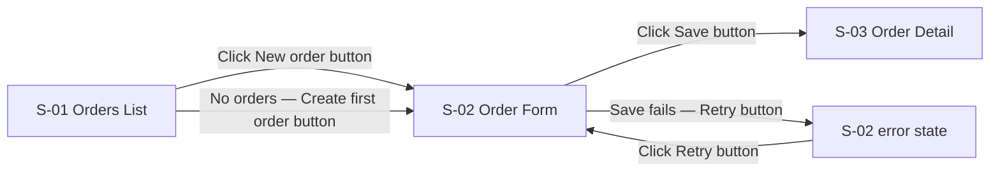

You are producing low-fidelity UX mockups for the project's operational scenarios: a screen
inventory (`ux/screens.md`), one screen flow per scenario, and one grayscale wireframe per
screen. You then rewrite the ConOps scenario steps so each names the screen and the exact control
it uses. Mockups are **planning artifacts** approved by the `docs/` branch merge — they are not
requirements and not code. Low fidelity is deliberate: no colors, no typefaces, no brand, no
imagery. Aesthetic choices happen later, in the walking-skeleton epic that `/peak-workflow:plan-project`
forms. Do **not** invoke the `frontend-design` skill from this skill.

The user's request (scenario title, or blank for all scenarios): $ARGUMENTS

---

## Project Type Guard

**Before any other action (read-only):** read `CLAUDE.md` at the repo root (do not re-read if
already in context) and take the **Project type** from its `Tool Hygiene & Operability`
section. If it is `CLI tool`, `Library`, `Service or API`, or a `Hybrid` whose description names
no UI, print and stop — before the branch guard, so a non-UI project never sees a branch question:

> `mockup` does not apply to `<type>` projects — there are no screens to prototype.
> Continue with `/peak-workflow:capture-requirements`.

If the section is missing, ask via `AskUserQuestion`:
- Question: `"CLAUDE.md has no Tool Hygiene & Operability section, so the project type is unknown. Is this a Web app, a Desktop app, or something without a UI?"`
- Options: `["Web app", "Desktop app", "No UI — stop"]`

On "No UI — stop", end here. Otherwise carry the project type into Step 1.

## Step 0: Branch Guard

**After the project type guard:**

1. Run `git branch --show-current`. Capture the result as `<current-branch>`.
2. If `<current-branch>` is `develop`, `main`, or `master` — stop immediately:

   > `mockup` writes planning artifacts (screen inventory, flows, wireframes) and rewrites
   > ConOps scenario steps. These changes must travel through a `docs/{task-short-name}` branch
   > so the merge event serves as the approval gate. Run `/peak-workflow:discover` first — it
   > will create the `docs/` branch and produce the ConOps this skill needs. Or create the
   > branch manually:
   > ```bash
   > git checkout -b docs/{task-short-name}
   > ```

3. If `<current-branch>` does **not** start with `docs/` (and is not develop/main/master) —
   warn the user but allow continuation:
   > Current branch (`<current-branch>`) is not a `docs/` branch. Proceeding will mix
   > mockup and ConOps changes with other work on this branch.

   Use `AskUserQuestion`:
   - Question: `"Current branch is not a docs/ branch. Continue anyway, or stop to create one?"`
   - Options: `["Continue on this branch", "Stop — I'll create a docs/ branch first"]`

   If the user chooses Stop, end here.

4. If `<current-branch>` starts with `docs/` — continue. No action needed.

## Layout Guard

**Before any other action after the branch guard:** check whether `docs/implementation-plan/index.md` contains a legacy status table header — a line matching `| Phase | Epic |` with a `| Status |` column present in the file. If the legacy header is found, stop immediately and print:

> This project uses the pre-v2.5.0 implementation-plan layout. Run `/peak-workflow:migrate-2.5` once to upgrade to the new layout (per-phase indexes + status sidecars), then retry your command.

Do not attempt the skill's normal flow on a legacy layout.

---

Follow these steps exactly:

## Step 1: Load Context

1. From `CLAUDE.md` (already read by the Project Type Guard), capture:
   - **Project type** — as resolved by the Project Type Guard (Web app, Desktop app, or a
     Hybrid with a UI).
   - The **UX Baseline** section, when present: the declared design system (default shadcn/ui),
     the *Screen states* line, the *Layout floor* line (minimum width or window size), and for
     desktop apps the *Desktop conventions* line (standard menus, accelerators, window-state
     persistence). If the section is absent, note it — Step 3 assumes shadcn/ui primitives and
     Step 10 advises running `/peak-workflow:setup`.
   - Set `is_desktop = true` when the project type is `Desktop app` or a Hybrid that names a
     desktop UI.
2. Read `docs/product-vision-planning/product-vision.md` — Sections 6 (MVP Scope Summary),
   8 (Key Business Scenarios), and 9 (Design Direction). If missing or skeleton (no substantive
   `## 2. Problem Statement` content), stop:
   > Run `/peak-workflow:discover` first to produce the product vision and ConOps documents.
3. Read `docs/product-vision-planning/concept-of-operations.md` — Sections 4 (User Roles &
   Profiles), 5 (Operational Scenarios), and 7 (Functional Summary). If missing, skeleton, or
   Section 5 has no numbered steps, stop with the same message. Capture the ConOps
   **Document Version** and each scenario's title and numbered steps. Refer to steps as
   `S{scenario}.{step}` (e.g., `S3.4` = Scenario 3, step 4).
4. List existing UX artifacts:
   ```bash
   ls docs/product-vision-planning/ux/ docs/product-vision-planning/ux/wireframes/ 2>/dev/null
   ```
   If `docs/product-vision-planning/ux/screens.md` exists, read it in full and capture every
   `S-NN` ID, name, and the highest existing number.

Report the loaded state:
```
Mockup context:
- Project type: [Web app / Desktop app / Hybrid (UI)]   Desktop conventions: [yes / no]
- Design system: [from UX Baseline, or "not declared — assuming shadcn/ui"]
- Layout floor: [e.g., 320 px / 800×600 window / "not declared"]
- ConOps v[N.N]: [N] scenarios, [N] steps total
- Existing screens.md: [none / N screens, highest S-NN]
- Scope: [all scenarios / "Scenario N: {title}" from $ARGUMENTS]
```

If `$ARGUMENTS` names a scenario that does not match any ConOps Section 5 title (case-insensitive
substring match), list the available titles and ask the user to pick one via `AskUserQuestion`.

---

## Step 2: Detect Greenfield vs Brownfield

First, in either mode, list the unprocessed discovery changelogs:
```bash
ls docs/product-vision-planning/changelogs/discovery-changelog-*.md 2>/dev/null | grep -v '\.processed$'
```
If two or more are listed, stop before drafting anything — Step 7 could write the UX delta to
neither. Print the same message `/peak-workflow:capture-requirements` 3B.1 uses:
> Found {N} unprocessed discovery changelogs:
> {list filenames}
>
> Please reconcile — delete superseded ones or merge their "New Capabilities" sections into a
> single file, then re-run.

**Greenfield** = `ux/screens.md` does not exist or has zero screen rows. All scenarios in scope
are processed from scratch (or only the scenario named in `$ARGUMENTS`).

**Brownfield** = `ux/screens.md` exists with at least one screen row. Existing screens are the
baseline; this run only **adds or changes** screens for the scenarios named in `$ARGUMENTS` or
in the unprocessed discovery changelog listed above. Read the changelog **read-only** — do not
archive or rename it; `/peak-workflow:capture-requirements` does that. Its "What Changed" rows
for `concept-of-operations.md` Section 5 identify the scenarios in scope. A changelog whose
`**Mode:**` line reads `Brownfield (UX concretization)` is this skill's own output from an earlier
run on this branch — it names no changed scenarios, so for scoping it counts as no discovery
changelog: fall through to `$ARGUMENTS` or the git-diff fallback below. It still counts toward
the two-or-more stop above and still receives the Step 7 item 5 in-place replace. If `$ARGUMENTS`
is empty and no discovery changelog scopes the run, diff the ConOps against the last commit that
touched `ux/screens.md`:
```bash
git diff $(git log -1 --format=%H -- docs/product-vision-planning/ux/screens.md) -- docs/product-vision-planning/concept-of-operations.md
```
Scenarios whose steps changed are in scope. If nothing is in scope, say so and stop.

Set `feature_files_exist = true` when `docs/requirements/*.feature.md` matches at least one file
— Step 7 uses it.

Report detection:
```
Mode: [Greenfield / Brownfield]
Scenarios in scope: [list of "Scenario N: {title}"]
Unprocessed discovery changelog: [filename / filename (UX concretization — not used for scoping) / "none found"]
```

---

## Step 3: Screen Inventory

Derive the inventory from the ConOps Section 5 steps of every scenario in scope. Walk each step
and ask: *which screen is the actor looking at, and which control do they use?* A screen is a
distinct place in the app the user can name ("the Orders list", "the Edit Supplier dialog") —
not a component and not a state.

Use the discover interview protocol: **draft first**, present, ask the user to *confirm, refine,
or reject each item*, iterate at most **2 rounds**, then gate. Round 1 presents the inventory
alone; round 2 presents the revised inventory together with the screen flows from Step 4.

### 3.1: Draft the inventory

One row per screen, with these columns (the table format is in
`plugins/peak-workflow/skills/mockup/SCREENS_TEMPLATE.md`):

| Column | Rule |
|---|---|
| **Screen ID** | `S-NN`, 2-digit zero-padded, sequential from `S-01`. Brownfield: continue from the highest existing number; never renumber. |
| **Name** | Title-case noun phrase the user would say — "Orders List", "Order Detail", "Sign In". |
| **Wireframe** | `wireframes/S-NN-<kebab-name>.html`, relative to `ux/` — the file Step 5.1 writes. The Application menu and Window rows write `—`. Downstream skills copy this path verbatim into epic `## Screens` tables. |
| **Purpose** | One sentence: what the actor accomplishes here. |
| **Entry points** | How the user arrives: a nav item, a control on another screen (`S-02 "Open" button`), a deep link, app launch. |
| **Primary actions** | Each action **names its control and its visible text** — "Save button", "Delete… menu item", "Status filter select". No bare verbs. |
| **Data shown** | The fields, lists, and counts the screen renders. |
| **States** | `loading / empty / error / populated` — every data-bearing screen has all four. A screen with no data (e.g., a pure form, an About dialog) says `n/a — not data-bearing`. |
| **Serves** | The ConOps steps this screen serves, `S3.4` style, comma-separated. |

Rules:
- Every ConOps step in scope maps to **exactly one** screen. A step that reads "user opens X and
  edits Y" is two steps for this purpose — split it in Step 7 when rewriting the ConOps.
- Steps with no UI (a background job runs, an email is sent) are recorded as `n/a — no screen`
  in Step 9; do not invent a screen for them.
- Prefer the fewest screens that satisfy the scenarios. A dialog or sheet that has its own
  actions and data is a screen; a confirmation dialog for a destructive action is **not** — it
  is an action on its parent screen and appears in the wireframe's populated state.
- Scenario 1's thinnest list screen carries the entity's row-level `"Delete…"` action, with its
  confirmation dialog in the populated state (as `WIREFRAME_TEMPLATE.md` shows) — this is what
  the **Destructive actions** baseline TOR in `/peak-workflow:capture-requirements` anchors on.
- Keep to the design-system primitives the UX Baseline declares (default shadcn/ui). Name nothing
  the walking skeleton cannot compose from them.
- **Desktop apps (`is_desktop = true`)** also get two rows that share the ID space but are not
  screens: an **Application menu** row (Primary actions = every menu and its items with
  accelerators, following the platform order the UX Baseline *Desktop conventions* line names)
  and a **Window** row (Data shown = minimum size, remembered bounds and maximized state, title
  format including the unsaved marker). Both use `States: n/a — not data-bearing`.

### 3.2: Draft the States

For every data-bearing screen, draft the four states as one short line each:
- **loading** — what is skeletoned or spinning, and what text (if any) is visible.
- **empty** — the visible text ("No orders yet") and the call-to-action control it offers.
- **error** — the visible text naming the problem *and* the next action, plus the retry control.
- **populated** — what is rendered when data exists (reference the Data shown column).

### 3.3: Present round 1

Show the inventory table and the states list. Ask:

> Confirm, refine, or reject each screen and state. Say "confirm all" if the draft is right.

Incorporate the feedback. Then proceed to Step 4 — the second round presents inventory and flows
together.

---

## Step 4: Screen Flows

### 4.1: Draft one flow per scenario

For each scenario in scope, draw a mermaid `flowchart LR`:
- **Nodes** = screens, labeled with ID and name. Use the ID without the hyphen as the node
  handle: `S01["S-01 Orders List"]`.
- **Edges** = user actions, labeled with the action *and the control*: `-->|"Click New order button"|`.
- Start at the scenario's entry screen (or `Launch(["App launch"])` for desktop apps); end at the
  screen where the Outcome is visible.
- **Draw error and empty branches explicitly**: an edge to the same screen's error state
  (`S02 -->|"Save fails"| S02err["S-02 error state"]`) and the empty branch where a list may
  have no items. A flow with only a happy path is incomplete.

Example:


### 4.2: Present round 2 and gate

Show the revised inventory, the states, and every flow. Ask once more to confirm, refine, or
reject each item. Apply the feedback (this is the last refinement round), then gate via
`AskUserQuestion`:
- Question: `"Approve this screen inventory and these flows, or adjust before I draw the wireframes?"`
- Options: `["Approve — draw the wireframes", "Adjust — I'll describe the changes"]`

If Adjust, apply the described changes once and proceed without re-asking.

### 4.3: Write screens.md

Write `docs/product-vision-planning/ux/screens.md` following
`plugins/peak-workflow/skills/mockup/SCREENS_TEMPLATE.md` (`mkdir -p docs/product-vision-planning/ux/wireframes`
first). Greenfield: create it at version 1.0. Brownfield: append new rows, `## States`
subsections, and `## Flows` blocks per the template's append note; replace a changed screen's
row and states in place; bump the document version (minor) and date.

---

## Step 5: Wireframes

### 5.1: One HTML file per screen

For every screen in scope (not the Application menu and Window rows), write the file its
`Wireframe` column in `ux/screens.md` names —
`docs/product-vision-planning/ux/wireframes/S-NN-<kebab-name>.html` — following
`plugins/peak-workflow/skills/mockup/WIREFRAME_TEMPLATE.md`. Each file is self-contained:

- **Inline CSS only** — grayscale palette, system font stack, dashed region boxes with a small
  uppercase label. No external stylesheets, fonts, images, or scripts. No colors, no typefaces,
  no brand marks.
- **Header line** with the screen ID, name, the ConOps steps it serves, and its entry points.
- **Mock menu bar strip** naming the menus (desktop apps only; delete it for web apps).
- **State switcher** — four buttons (Loading / Empty / Error / Populated) toggling four
  `section.state` blocks with plain JS. The Populated state is active on load. A screen marked
  `n/a — not data-bearing` keeps only the Populated section and drops the switcher.
- **Regions** — one `div.region` per layout area, each carrying `data-component` naming the
  design-system primitive it will become: `Button`, `Dialog`, `Table`, `Form`, `Input`,
  `Sidebar`, `Tabs`, `Sheet`, `Toast` (add `Card`, `Select`, `Checkbox`, `Breadcrumb` only if the
  screen needs them). This is what the walking skeleton and later slices compose from.
- **Every control labeled with its visible text** — the exact text from the Primary actions
  column ("Save", "Delete…", "New order"). Placeholder data uses striped `.placeholder` blocks,
  not lorem ipsum.
- **Error and empty states carry their real copy** — the text drafted in Step 3.2, naming the
  problem and the next action, with the retry or call-to-action control present.
- **Destructive actions** show their confirmation dialog inside the Populated state as a
  `data-component="Dialog"` region whose safe option (Cancel) is listed first.
- **Footer** listing the ConOps step refs and the screens this one links to.
- The `:focus-visible` outline in the template stays — the wireframe itself models keyboard
  focus. Every control must be a real `button`, `a`, `input`, or `select` so Tab reaches it.

### 5.2: ux/README.md

Write `docs/product-vision-planning/ux/README.md` — one paragraph: these are low-fidelity
planning wireframes produced by `/peak-workflow:mockup`; open any `wireframes/*.html` file
directly in a browser (no server needed) and use the state buttons to switch loading / empty /
error / populated; they are grayscale on purpose — visual design happens in the walking-skeleton
epic; `screens.md` is the inventory and the ConOps references screens by their `S-NN` IDs.
Create it only if it does not exist.

### 5.3: Optional design-canvas publish

If a design-canvas skill (e.g., one named `design`) is available in this session, offer **once**
via `AskUserQuestion`:
- Question: `"A design-canvas skill is available. Also publish these wireframes there for hand-tweaking? The HTML files under ux/wireframes/ remain the committed artifact either way."`
- Options: `["Yes — publish to the canvas too", "No — HTML files only"]`

If Yes, hand the wireframes to that skill as grayscale artboards, one per screen, and instruct it
to add no colors, typefaces, or imagery. Do not wait on the canvas to continue; do not invoke
`frontend-design` under any circumstances. If no such skill is available, skip this sub-step
silently.

---

## Step 6: Review Gate

Tell the user:

> Wireframes are written. Open `docs/product-vision-planning/ux/wireframes/` in a browser
> (double-click any file) and click through the state buttons on each screen.

Use `AskUserQuestion`:
- Question: `"Approve these wireframes, or tell me what to adjust?"`
- Options: `["Approve", "Adjust — I'll describe the changes"]`

If Adjust, apply the changes to the affected wireframe files **and** to the matching rows,
states, or flows in `ux/screens.md` (they must not drift), then ask again. Maximum **2 adjustment
rounds** — if still adjusting after round 2, apply the most recent changes and proceed.

---

## Step 7: Feed Back into ConOps

Rewrite the ConOps Section 5 steps of every scenario in scope so the requirements capture can
cite named screens and controls. **Never change scenario intent** — only make each step
concrete.

1. **Rewrite each step** to name the screen (by name, with the ID in parentheses) and the exact
   control text it uses. Split a step that touches two screens into two numbered steps.

   Before:
   ```
   3. User creates a new order and saves it.
   ```
   After:
   ```
   3. On the Orders List (S-01), user clicks the "New order" button; the Order Form (S-02) opens.
   4. User fills the Customer and Quantity fields and clicks the "Save" button; the Order Detail (S-03) shows the new order.
   ```
   State-dependent steps name the state: `…the Orders List (S-01) shows its empty state with the "Create first order" button`.
2. **Add a Screens cross-reference line** directly under each rewritten scenario's `**Outcome:**`
   line:
   ```
   **Screens:** S-01 Orders List, S-02 Order Form, S-03 Order Detail
   ```
3. **Update the header:** bump the ConOps **Document Version** by a minor increment (1.0 → 1.1)
   and set **Date** to today. Also set the `**Companion:**` line in `ux/screens.md` to the bumped
   ConOps version — Step 4.3 wrote it before the bump.
4. Do not touch Sections 1–4 or 6–9, and do not rewrite scenarios out of scope.
5. **Discovery changelog** — write one only when `feature_files_exist = true` (Step 2), in
   either mode. Otherwise the coming `/peak-workflow:capture-requirements` run is greenfield and
   would never consume it, and the stale file would later trip the two-unprocessed-changelogs
   stop — write no changelog. When it applies:
   - If exactly one unprocessed discovery changelog exists (Step 2 already stopped on two or
     more), append this section to it. If the changelog already has a `## UX Changes` section
     (a second run on the same `docs/` branch), replace that section in place rather than
     appending a second one:
     ```markdown
     ## UX Changes

     | Screen | Change Type | Summary |
     |--------|-------------|---------|
     | S-NN {Name} | [Added / Modified] | [1-line summary — which steps it now serves] |
     ```
   - If none exists, create `docs/product-vision-planning/changelogs/discovery-changelog-{TIMESTAMP}.md`
     with `{TIMESTAMP}` from:
     ```bash
     date -u +%Y-%m-%d-%H%M%S
     ```
     containing:
     ```markdown
     # Discovery Changelog

     **Date:** [today's date]
     **Mode:** Brownfield (UX concretization)
     **Previous Version:** ConOps [version before this run]

     ## UX Changes

     | Screen | Change Type | Summary |
     |--------|-------------|---------|
     | S-NN {Name} | [Added / Modified] | [1-line summary] |

     ## New Capabilities Identified

     None — UX concretization only.
     ```

---

## Step 8: Quality Check

Before the self-check, verify:

- [ ] Every ConOps Section 5 step in scope maps to exactly one screen (or is `n/a — no screen`).
- [ ] Every screen in `ux/screens.md` appears in at least one flow.
- [ ] Every data-bearing screen lists all four states in `ux/screens.md` **and** its wireframe
  has all four `section.state` blocks with matching copy.
- [ ] Every primary action names a control with its visible text; the same text appears in the
  wireframe and in the rewritten ConOps step.
- [ ] Every path in the `Wireframe` column of `ux/screens.md` exists under
  `docs/product-vision-planning/ux/` (`wireframes/S-NN-<kebab-name>.html`), and every file in
  `wireframes/` appears in that column. Only the Application menu and Window rows carry `—`.
- [ ] Every `div.region` carries a `data-component` value from the Step 5.1 list.
- [ ] Desktop apps: `ux/screens.md` has the Application menu and Window rows; every wireframe
  has the menu-bar strip.
- [ ] No color names, hex values other than grays, `font-family` other than the system stack,
  images, or external URLs anywhere in `ux/`. Run the hex test against each file's `<style>`
  block only — dialog copy such as `Delete order #0412?` would otherwise match — and the other
  checks file-wide:
  ```bash
  for f in docs/product-vision-planning/ux/wireframes/*.html; do
    sed -n '/<style>/,/<\/style>/p' "$f" | grep -oiE '#[0-9a-f]{3,6}\b' | grep -viE '^#(fff|f2f2f2|e5e5e5|999|777|222)$' | sed "s|^|$f: |"
  done
  grep -rnoiE 'font-family:[^;]*|url\(|.html` — [one line per file written]
- `docs/product-vision-planning/ux/README.md` — [Created / unchanged]
- `docs/product-vision-planning/concept-of-operations.md` — Section 5 steps concretized, v{N.N}
[Only when `feature_files_exist = true`:] - `docs/product-vision-planning/changelogs/discovery-changelog-{TIMESTAMP}.md` — [UX Changes appended / replaced / created]

### By the Numbers
- Screens: {N} ({M} new, {K} modified) [desktop: + Application menu and Window rows]
- Flows: {N} (one per scenario in scope)
- Wireframes: {N} files, {N} data-bearing screens × 4 states
- ConOps steps concretized: {X} of {Y} in scope ({Z} split)
- Trace gaps resolved: {M}

### Self-Check (final passing table)
[Paste the full trace table from Step 9 — every row Explicit=Y and Ambiguous=N, or an explicit
n/a / N/A entry]

[If the UX Baseline section was absent in Step 1:]
### Advisory
`CLAUDE.md` has no **UX Baseline** section. Run `/peak-workflow:setup` before
`/peak-workflow:capture-requirements` so the baseline UX TORs (screen states, keyboard and focus,
forms, destructive actions, progress feedback, layout floor[, desktop conventions]) are derived
against these screens.

### Next Step
Run `/peak-workflow:capture-requirements` next on this same `docs/` branch. It reads
`ux/screens.md` and the concretized ConOps, and cites screens and states (`S-NN`) in its
Given/When/Then and trace table. After that, `/peak-workflow:plan-project` forms the
walking-skeleton epic that installs the design system, builds the app shell, and ships the
reference screen these wireframes assume.
```

**Do NOT commit.** The full planning sequence (`discover` → `mockup` → `capture-requirements` →
`plan-project` → optional `add`) runs on the `docs/` branch before the user merges. Committing
happens only at the `plan-project` Commit Gate, with the user's confirmation, and the merge
(solo or team PR) is the approval gate for the mockups, requirements, and plan as a unit.
